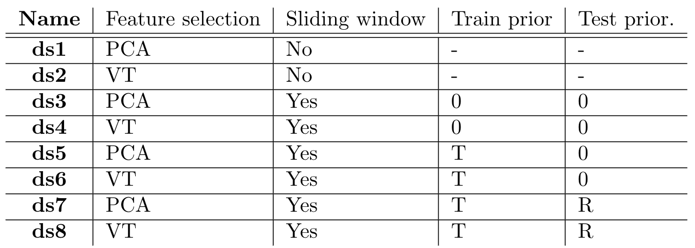

# Active Learning for Music
AI-Project with Active Learning for music - developed by students at Linköping University. The point of this project is to evaluate the efficiency of different Machine Learning models and query strategies for Active Learning - when used for predicting human emotion based on music listening experiences.

## Overview
- [Active Learning for Music](#active-learning-for-music)
  - [Overview](#overview)
  - [Architecture](#architecture)
  - [Learning Profiles](#learning-profiles)
  - [Sliding Window](#sliding-window)
  - [Initial Setup](#initial-setup)
  - [Acquire and Build Datasets](#acquire-and-build-datasets)
  - [Run Code](#run-code)

## Architecture
The architecture can be divided into two different parts: the *API layer*, which consists of functionality for handling data, GUI, ML/AL etc. - and the *execution layer*, which is responsible for utilizing the API to perform required tasks. All code relating to the API may be found in `src/api/` while the execution code lies in `src/`.

More specifically, the execution layer is devided into 5 different so called *processes*. When the program starts, one process is executed, and when the process terminates, so does the program. In order to communicate between processes, files are usually outputted so that they can be divided between each other.

Processes may consist of *phases*. These are reusable sub-modules, which are independent of each other, and processes may use any of these whenever desired. Note that phases can also be reused in different processes.

There are 5 different processes, each represented by a green box in the figure below (the purple boxes represent phases):

The *Feature Extraction* and *Feature Selection* processes may be found in `src/api/features_extraction.py` and `src/api/feature_selection.py`. These are considered to be part of the setup, and should be executed according to [Acquire and Build Datasets](#acquire-and-build-datasets).

The remaining processes are all found in `src/processes.py`. These may be launched through `src/launch.py` according to [Run Code](#run-code).

Phases are located in their own separate files in `src/`.

## Learning Profiles
In order to evaluate the performance of different prediction strategies, this project creates so called *Learning Profiles*.

A Learning Profile is an object that contains information about the following: what training and test datasets should be used for training and evaluation, what machine learning model should be trained and what active learning query strategy that should be used. The *init phase* is responsible for generating all Learning Profiles that are to be evaluated. For more information about evaluation, see [Run Code](#run-code). 

The data sets that are used to generate learning profiles can be seen below, along with their respective names and some characteristics:

Details about feature selection can be found under [Acquire and Build Datasets](#acquire-and-build-datasets) and details about priors and sliding window can be found under [Sliding Window](#sliding-window)

Note that by creating Learning Profiles that have different hyperparameters, but which are otherwise the same, the models are implicitly tuned.

A few examples of what a Learning Profile can look like is shown in the table below:

## Sliding Window
The ability to add a *sliding window* of a user defined size to a data set exists. This is in order to try to capture the chronological correlation of emotions in music, and it can be done in a few different ways. In the implementation a separation is made between how training and test data is configured with a sliding window. For training data, the labels from the training data set are used as indicators of emotion for the previous samples, while for test data a basic linear regressor is used to predict the emotion of previous samples in order to get an indication of the emotion. 

For both training data and test data a prior must be chosen, the prior will act as labels/predictions for the first samples of each song in the train/test dataset when configuring the sliding window. The options for training data are, one prior for all songs and no prior at all. When no prior is passed, the labels from the first few samples are used as prior, and those samples are then not used during the training. The options for test data are either one prior for all songs or a different prior for each song. 

Below is an illustration of how a sliding window size of *r* works on one song in the training data with a prior.

## Initial Setup
To be able to run Active Learning and Classification on the dataset(s), an initial setup needs to be performed; follow the steps provided in [setup.md](docs/setup.md).

## Acquire and Build Datasets
Read all of the instructions in [dataset.md](docs/dataset.md) to acquire and build datasets. Make sure that you perform both *feature extraction*, *feature selection*, and *label adding*.

## Run Code
Follow the instruction in [run.md](docs/run.md) to run *model selection*, *model evaluation*, and *presentation*.
